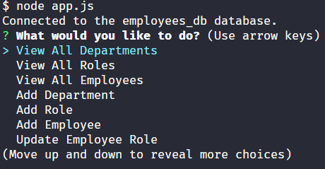

# Employee-Tracker
A content management system that allows users to easily view and interact with employee information stored in our database.  This is a command-line application built from scratch to manage a company's employee database, using Node.js, Inquirer, and MySQL.

## Description
This application allows an organization to perform the following tasks:
'View All Departments'
'View All Roles'
'View All Employees'
'Add Department'
'Add Role'
'Add Employee'
'Update Employee Role'

Employees are one of the most important resources of any organization. Information about the employees must be accurately and securely managed. This application provides four key features taht will help the organization better understand itself in many ways.
1) Organizational Efficiency
2) Reporting 
3) Data Organization
4) User Friendly Interface

While creating this employee tracking application, I gained experience and familiarity with these various skills and concepts:
1) Database Interaction - Executed SQL queries to retrieve, insert, and update data in the database.
2) Inquirer Library - Implemented prompts to capture user input and make decisions based on their choices.
3) Async/Await - Managed asynchronous operations, such as querying the database and waiting for the results.
4) Console.Table Library - Utilized the console.table library to display database query results in a tabular format in the console.
5) Switch Statements - Implemented switch statements to execute different code blocks based on user choices.

## Installation
To install this project, clone the GitHub repository into your local machine.
[GitHub Repo](https://github.com/nicklearning/employee-tracker)

## Usage
To use this application:
1) Install the node packages by running the 'npm i' command in the Terminal.
2) Run 'node app.js' command in the terminal.
3) Select the prompts to modify the database as needed. 

## Screenshots

## Credits
Coding assitance was given by ChatGPT
